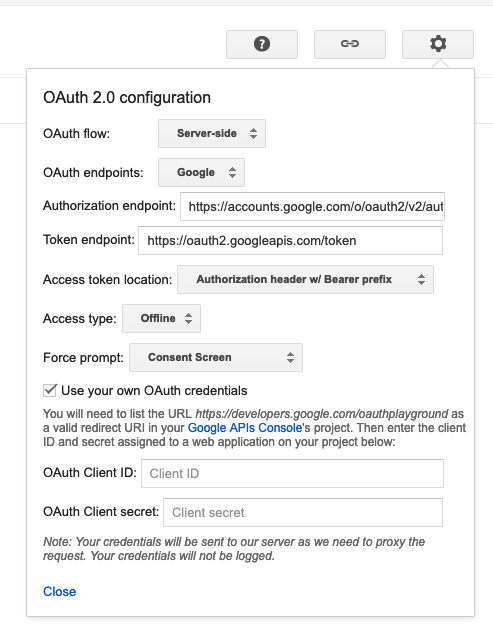

# contact page mailer

I followed [this article](https://medium.com/@RistaSB/use-expressjs-to-send-mails-with-gmail-oauth-2-0-and-nodemailer-d585bba71343). That is up until the [oauth playground](https://developers.google.com/oauthplayground/) step. When you make your request for a refresh token you need to set the oauth2 configuration like so:

I put the credentials in a file called creds.json which is in the .gitignore. I made a `creds.sample.json` that you can use for the key values.